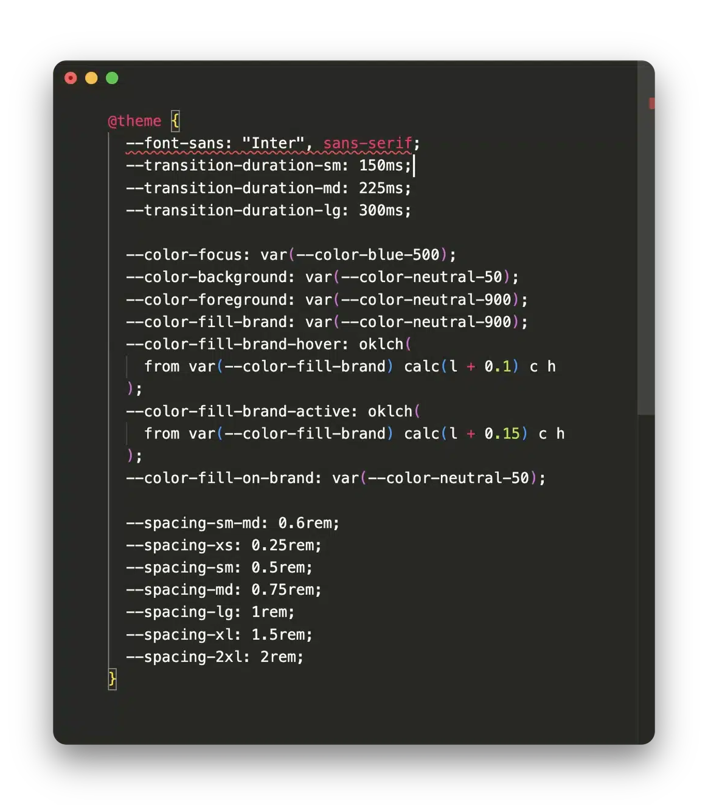

<div align="center">
	
</div>

<h1 align="center">eslint-plugin-tailwind-variants</h1>

<div align="center">
	
	
	
</div>

<br />

ESLint plugin to enforce best practices and consistent naming conventions for tailwind-variants.

Automatically enforces proper variable naming, limits excessive inline classes, and promotes clean tv() usage with auto-fix support. This plugin supports a wide range of projects, including React, Vue, plain JavaScript or TypeScript.

<div align="center">
  
</div>

## Installation

```sh
npm i -D eslint eslint-plugin-tailwind-variants
```

## Quick start

1. Depending on your environment you may need to install the following dependencies:

```sh
# TypeScript
npm i -D @typescript-eslint/parser

# Vue
npm i -D vue-eslint-parser
```

2. Enable the `recommended` config in your ESLint config:

```js
// eslint.config.{js|ts)

// ...
import tailwindVariants from "eslint-plugin-tailwind-variants";

export default defineConfig([...tailwindVariants.configs.recommended]);
```

### Editor setup

If you are using the ESLint plugin in VS Code add the following to your `settings.json` to enable `css` linting:

```json
{
  "eslint.validate": ["css"]
}
```

### Rules

| Name                                                                                 | Description                                                                                                                                               | `recommended` | autofix |
| ------------------------------------------------------------------------------------ | --------------------------------------------------------------------------------------------------------------------------------------------------------- | ------------- | ------- |
| [require-variants-call-styles-name](docs/rules/require-variants-call-styles-name.md) | enforce that when calling a function returned by tailwind-variants (`tv()`), the result is assigned to a variable named `styles` (or a configurable name) | ✔             | ✔       |
| [require-variants-suffix](docs/rules/require-variants-suffix.md)                     | require variables assigned from tv() to end with a specific suffix                                                                                        | ✔             | ✔       |
| [limited-inline-classes](docs/rules/limited-inline-classes.md)                       | enforce limited number of inline class names and prohibit cn() usage                                                                                      | ✔             |         |
| [sort-custom-properties](docs/rules/sort-custom-properties.md)                       | enforce consistent ordering of CSS custom properties (CSS variables)                                                                                      | ✔             | ✔       |
